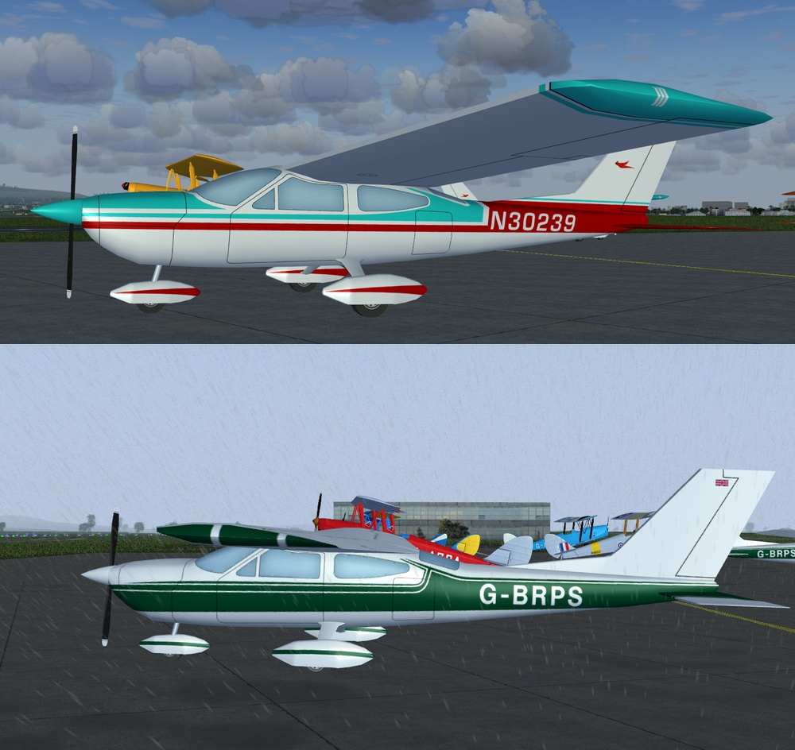
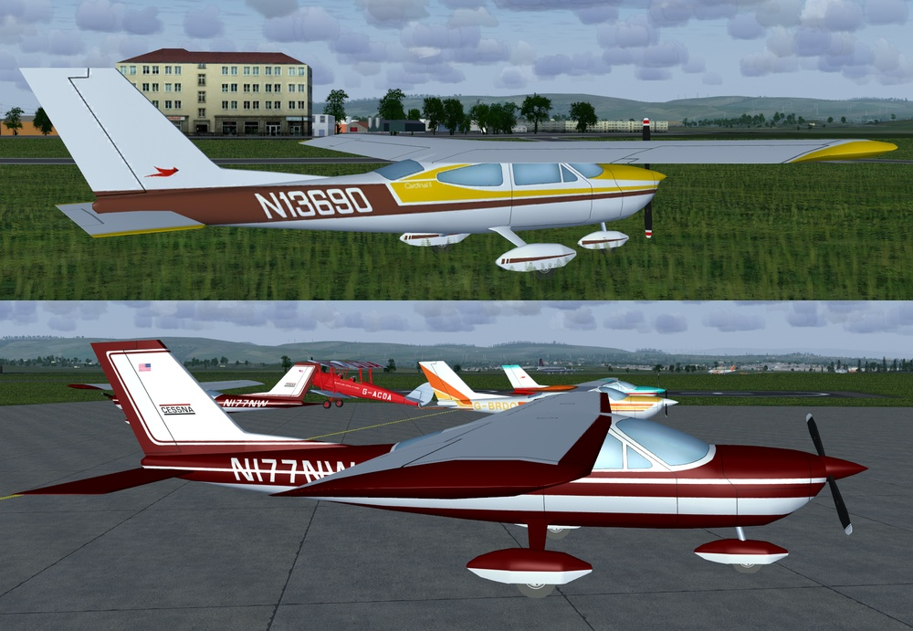
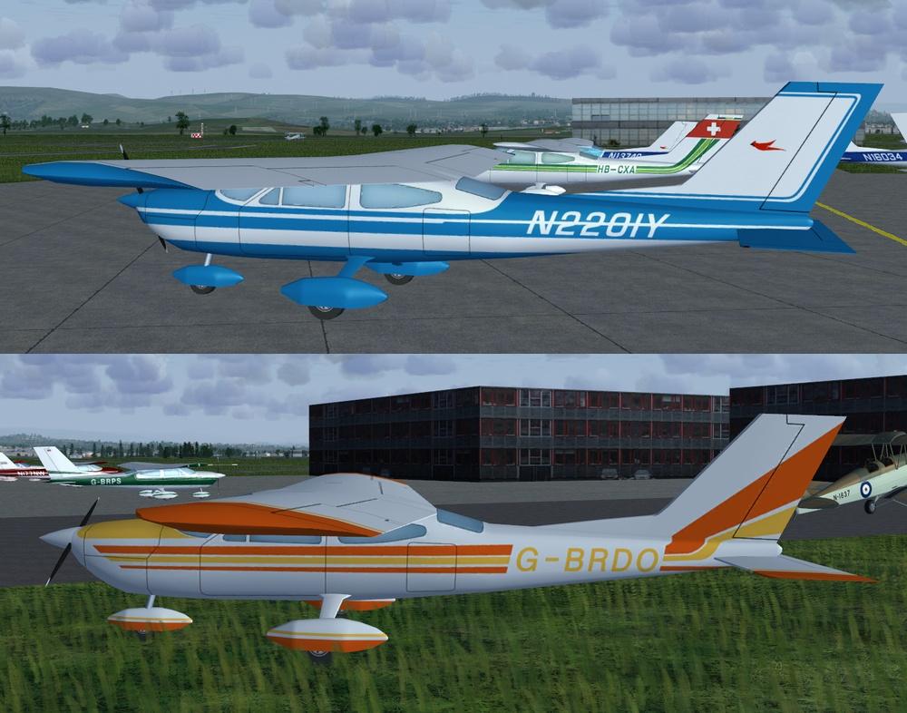
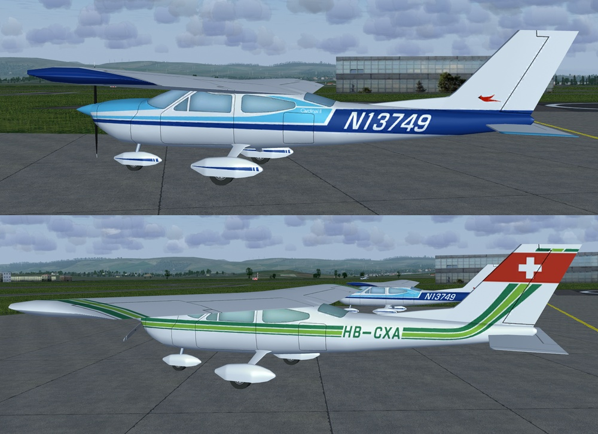
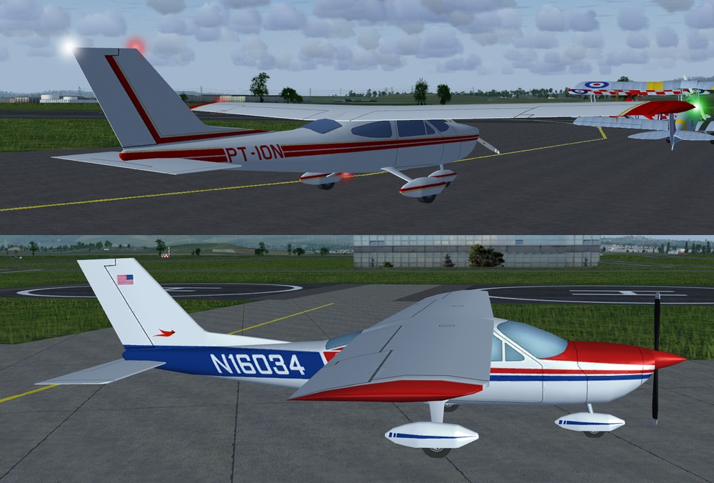

# Cessna 177
## AI Aircraft for FlightGear

This model is already available in FlightGear but this version has a couple more liveries and lights added.

Download the zip file and extract the "c177" folder into the "$FG_ROOT/AI/Aircraft" folder. 
The existing "c177" files can be overwritten or backed up elsewhere before extraction.

To use you will need to create a traffic file, see the wiki for instructions.
 http://wiki.flightgear.org/AI_Traffic

There is a simple AI Traffic Creator here: 
https://github.com/gooneybird47/FlightGear-AI-Traffic-Creator
